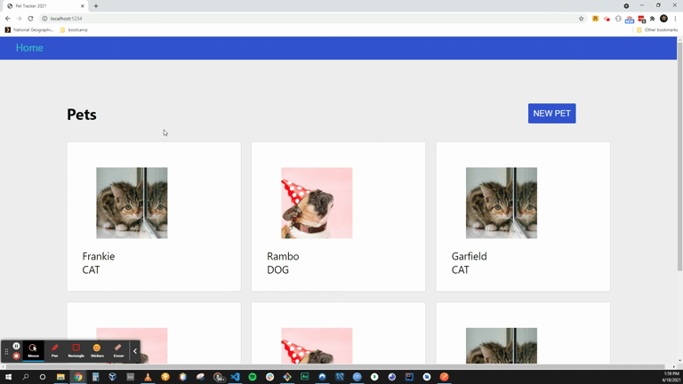

# Fullstack GraphQL
> ## Learn how to use GraphQL with Node and React

Topics Covered:

* Instantiating Apollo Client
* Utilizing the Apollo Provider to serve the client to our various components
* Querying APIs using `useQuery` hook
* Creating new items with `useMutation` hook
* Updating existing records with new data with `useMutation`'s `update` functionality.
* Implementing "Optimistic UI" to pre-render components with assumed data from API.
* Defining client-side schema and data, and integrating it with server-side API calls.
* Utilizing query `fragments` to reduce code repetition.

Summary:

Overall this lecture series was <em>incredible</em>!  I learned so much in the inner working and intricacies of Graph QL and Apollo Client.  